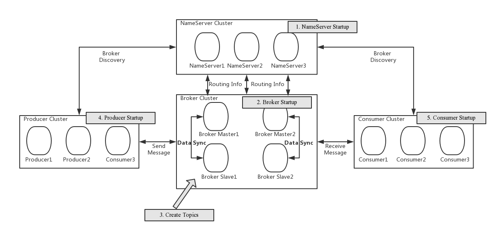
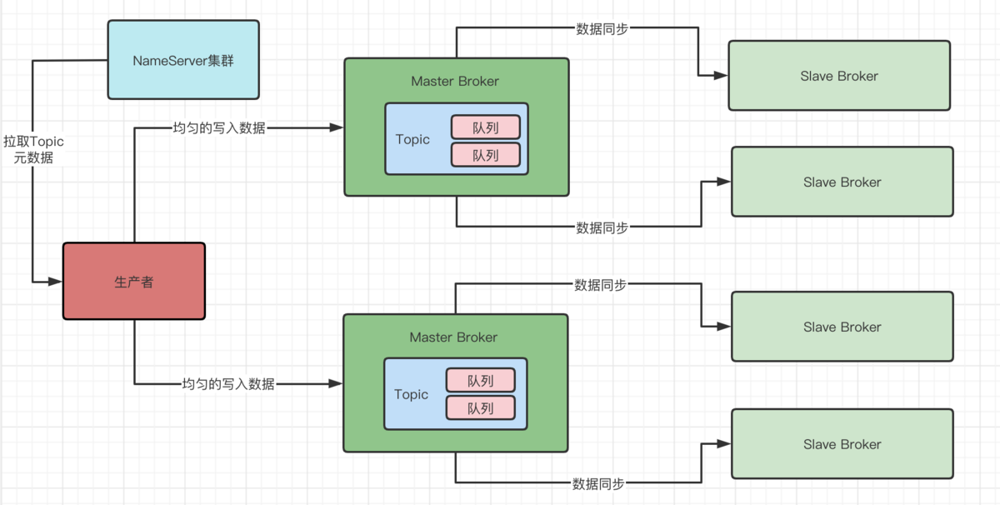

MQ

应用：

设计目标：
1、高性能 异步+水平扩容
2、高可用  broker master+slave 多个broker
3、业务分离
4、高可靠

优势
1、削峰填谷
解决大量写请求无法瞬时完成，导致奔溃和丢失问题
2、重要程度不同、能力不同的系统之间的解藕
主次系统分离
3、提升一对多通知时的性能和减少开发成本，只需开一个topic，下游系统自己对接就好了
4、蓄流压测

原理篇

消息怎么发送、怎么存储、怎么消费？
服务端

1、Name Server：类似注册中心，broker的上报信息都是在name server 的内存中。客户端(producer、consumer)先从name server集群中随机 获取broker的信息，然后和broker通信，通信之后，name server宕机不影响之后的链接。name server之间并不通信，也无关联，严格上讲不是集群关系，而是独立的关系。
nameserver几乎是无状态节点，注册是向所有的name server 注册，nameserver之间无状态同步。为什么呢？因为简单啊。。。。
zk之间是会互相同步的，同步算法是raft，选举之类的。

2、broker：
消息存储、转发的服务器
broker以group划分，每个group有一个master、slave
只有master可以读写数据，slave只能读
slave可以同步双写同步消息，也可以异步复制(新开线程pull)。这取决于master的配置
客户端消费一般是从master消费，master挂了之后，从name server中感知，然后才从slave消费。也有master堆积的时候也可以从slave消费。
broker和nameserver 以长链接通信，注册topic信息。
问题：如何保证slave和master都在消费的情况下，不会重复消费的问题呢？

3、Filter Server
MQ的性能瓶颈一般是在网卡，而不在CPU，通常CPU是空闲的。为了降低网卡资源，充分利用CPU。就提出filter server概念，允许broker先过滤消息，再发送，这样达到用CPU换网卡资源的目的。缺点是安全风险，如果上传的Java类有申请大量内存的操作时，会有很大的安全风险。
Filter server只能在broker服务器上，拉取消息时，会先进行过滤再发送消息。

核心概念
角色
producer
consumer
pushconsumer:
pullconsumer:需要自主处理拉取、消费、异常等动作。
术语
Producer Group：
Consumer Group
标示一类消息，消费将以consumer group为粒度管理，消息会被所有consumer group消费一遍。同一group下的消费者是只要消费一个，还是所有都要消费。
集群模式：同一个consumer group上的实例均匀消费发送到group上的消息。即消息只会被同一集群下的某一个实例消费。进度持久化在broker。
广播模式：同一个consumer group上的实例同时消费发送到group上的消息。即消息会被同一集群下的所有实例都消费一遍。进度持久化在consumer的实例上？？？

Message Queue：
一个topic会有若干个Q，如果分布在不同的broker上，则是不同broker下的Q，物理上不连续，逻辑上连续。每次发消息都是预先选好(通常是轮询)一条Q去发送。
consumer消费也是分配若干个Q。问题：如果某一个broker挂了，这个Q怎么处理？一条Q对应一个索引文件，即便这个Q被销毁了，但是实际的消息文件还是存在的。
Offset：
不特指的话就是Message queue的 offerset。一条消息进来message queue上，则offerset+1.
max_offerset则是最新的offerset+1.
min_offerset则是表示现存最小的offerset，每次消息被物理删除则min_offset+1
consumer offset是每一个consumer group就有一个。
consumer min offset  最小确认offset
consumer max offset 最大拉取offset

顺序消息：
顺序消息分为三部分部分：顺序发送、顺序存储、顺序消费。
顺序存储自带，无需解决。
顺序发送即保证producer发送到指定的message queue.
顺序消费即保证消息被指定的consumer顺序消费(顺序消费是由业务逻辑去控制)
缺点：
消费失败下，无法跳过，当前message queue暂停。
串行化性能很差

事务消息：

目标是保证生产端能执行完本地事务之后，broker再向消费端投递消息。

生产端事务开启前把半事务消息发送给broker，然后生产端本地起一个线程接收半事务消息的确认状态也就是第五步的回调消息。
生产端开始本地事务，然后commit或者rollback。commit则broker可以投递消息给订阅方，rollback则定期删除。
如果broker没有收到commit或者rollback，则会回查生产端。生产端根据本地事务状态确定是否二次提交或者rollback

水平扩展和负载均衡

Broker：
直接扩展多个broker group就能实现水平扩展。
负载均衡则可以通过设置message queue的数量来实现，或者负载均很算法。
数据都是顺序写在commit log，而message queue只是索引文件。

producer：
默认轮询所有的message queue发送，均匀落在不同的message queue。

consumer负载均衡
集群模式下：
每个message queue只会被一个consumer消费，而一个consumer可以绑定多个message queue。这是因为如果一个message queue可以被多个consumer消费，则会出现多次消费的情况。可以增加consumer实例去分摊message queue，实例下线，会重新触发负载均衡。一般要控制message queue数量大于consumer，不然多余的consumer没有message queue消费，造成空转

广播模式：唯一的不同就是，集群是一个message queue绑定一个consumer。广播是一个message queue绑定所有的consumer。

ACK机制以及进度管理
PushConsumer(即DefaultPushConsumer)的消息ACK机制以及消费进度管理
如何保证消费成功？
只有当consumer端的处理方法返回ConsumeConcurrentlyStatus.CONSUME_SUCCESS才认为是消费成功。
  consumer.registerMessageListener(new MessageListenerConcurrently() {
        @Override
        public ConsumeConcurrentlyStatus consumeMessage(List<MessageExt> msgs, ConsumeConcurrentlyContext context) {
            System.out.println(Thread.currentThread().getName() + " Receive New Messages: " + msgs);
            doMyJob();//执行真正消费
            return ConsumeConcurrentlyStatus.CONSUME_SUCCESS;
        }
    });
消费失败如何处理？
consumer返回ConsumeConcurrentlyStatus.RECONSUME_LATER(跑异常会默认返回这个状态，源码怎么体现？)则会认为消息失败。
为了保证消费成功，RocketMQ会把这批消息(是失败的还是失败+成功的？)重新发回broker(topic不是原来的topic，而是Retry topic)，在延迟10秒 再投放到consumer group里面.如果还是重复消费失败16次，则丢到死信队列人工来处理。

consumer启动时是从哪个offerset开始消费。
一般是去拿消费组的broker的消费进度(consumer offset)去拿。
如果消费进度在broker上没有，则说明是新的消费组，consumer端则可以选择
CONSUME_FROM_LAST_OFFSET //默认策略，从该队列最尾开始消费，即跳过历史消息
CONSUME_FROM_FIRST_OFFSET //从队列最开始开始消费，即历史消息（还储存在broker的）全部消费一遍
CONSUME_FROM_TIMESTAMP//从某个时间点开始消费，和setConsumeTimestamp()配合使用，默认是半个小时以前

消息ACK机制
Rocket MQ是以consumer group+message queue来管理消费进度的。每一个message queue都有一个consumer offset来标记这条message queue上的消费进度。
每次consumer消费成功，本地的消费进度会被更新，然后定时器会同步给broker。
消费进度是以最小的下标为准的，比如一批消息1-100，那么如果2-100号都消费完了，1号却没有消费完，那么进度始终都是1。如果这时1号还没消费完，consumer就退出了，那么下一次broker又会重新发送1-100给另一个consumer，这时会有重复消费的风险。需要做好幂等性。
在3.2.6之前的版本是无法解决这个问题的，不过也有代码在控制这一块的损失。consumeConcurrentlyMaxSpan，如果consumer 本地的最大offset-最小offerset大于该值，则会触发流控无法拉取新的消息

ack超时处理
1、pushConsumer有一个consumeTimeOut(默认15分钟)表示处理时间超过该值，则认为消费失败。消费前会记录开始时间，定时线程定期扫描，定时线程是在consumer启动时启动的。
2、那么会有问题，比如定时线程可能因为consumer线程调度问题而不精确，可能出现超过15分钟还没失败的问题。还有就是consumeTimeOut只在启动时设置，中途设置是无效的。

消息的存储：
消息是存储在commitlog中的，顺序写且不定长，也就是不能以消息为单位删除。
那么怎么保证发送的消息不会重复投递呢？就是每次consumer拉取消息的时候，响应体中都会返回下一次拉取的位置，也就是max_offset,pushconsumer根据这个值确定下次拉取的位置。两个消费者同时拉取10条，A拉取了1-10，B拉取了11-20.那么AB都会最终确定下次拉取位置为20.

清理commitlog时机
1、文件过期(默认72小时)，且到达清理点(默认凌晨4点)，删除过期文件
1、文件过期(默认72小时)，且磁盘到达水位线(默认75%)，删除过期文件
1、磁盘到达释放的上线(默认85%)，开始分批清理文件，无论过期
1、磁盘到达危险线(默认90%)，拒绝写入

commit log设计的好处
1、一份消息多方消费，不用复制多份。统一管理
2、进度消费权限是在客户端，客户端可以灵活消费，甚至可以回溯消息，只需要新开消费组从头消费即可，前提是消息文件还在。
3、持久化后还能索引原消息体。

如何跳过历史消息消费呢？
1、根据日期过滤，在消费时可以根据时间戳去过滤消息
for(MessageExt msg: msgs){
if(System.currentTimeMillis()-msg.getBornTimestamp()>60*1000) {//一分钟之前的认为过期
continue;//过期消息跳过
}
//do consume here
}
2、可以根据条数过滤，即通过消息的offset和maxoffset的差值来消费
long offset = msgs.get(0).getQueueOffset();
String maxOffset = msgs.get(0).getProperty(MessageConst.PROPERTY_MAX_OFFSET);
long diff = Long. parseLong(maxOffset) - offset;
if (diff > 100000) { //消息堆积了10W情况的特殊处理
return ConsumeConcurrentlyStatus. CONSUME_SUCCESS;
}
3、人工用控制台命令resetOffsetByTime把消费进度调整到后面
4、ResetOffsetByTimeCommand

消息可靠：如何保证消息能发送到broker。分为同步策略和刷盘策略。

同步策略：
broker role：ASYNC_MASTER、SYNC_MASTER、SLAVE。分别表示异步master、同步master、slave。
ASYNC_MASTERL：生产者写入master无需等待复制到slave即可返回，消息的复制由slave去定时复制
SYNC_MASTER：生产者写入master之后要等待至少一个slave同步完消息才返回RETURN_OK
消息状态除了SEND_OK，还有
FLUSH_SLAVE_TIMEOUT：等待slave同步消息超时
SLAVE_NOT_AVAILABLE：无可用的salve，如果超过master的max offset太多也会被认为是不可用，阈值用haSlaveFallbehindMax控制
slave:定时去拉去master的消息
在等待同步的时候并不是等待这条消息被同步到slave，等待同步是等待slave同步的max offset达到该条消息的offset，即会等待之前所有的消息同步完才会返回return ok。所以如果所有的slave进度都很落后时，发送的RT会上升，而TPS会下降。

刷盘策略：SYNC_FLUSH和ASYNC_FLUSH
同步刷盘是需要等待刷盘之后才能返回ok
异步是不需要等待刷盘就能返回OK
所以高可靠的本质是消息至少被写入了两个节点。异步master+异步刷盘。

要求高性能：异步master+异步刷盘
要求高可靠：同步master+同步刷盘
折中就是：同步master+异步刷盘

发送模式：
NormalProducer：producer会根据broker回应后才继续发送下一条。
消息异步发送：不用等broker回应就继续发送下一条，需要写回调处理。
producer.send(msg, new SendCallback() {
  @Override
  public void onSuccess(SendResult sendResult) {
    System.out.printf("%s%n",sendResult);
 }
  @Override
  public void onException(Throwable throwable) {
    throwable.printStackTrace();
 }
});
OneWay：单向发送，不管回应，不管回调，只管发送。



消息是分批的被消费，list里面的顺序和存储顺序一致，也和发送顺序一致

- [x] 为什么一个topic下多个broker有多个message queue，不能多个broker每个broker一个message queue吗？
答：因为broker通常是一个进程，为了开多个message queue而多开broker不划算。还可以通过message queue的数量来实现负载均衡

- [x] 同一条消息是每个message queue上都有，还是只有一个message queue拥有？
答：是只有一个message queue拥有。message queue类似数据分片的概念，所有的消息被划分到多个(默认4)message queue上，比如消息有10000条，那么是4个message queue加起来是10000条。具体分配是由策略做决定。

- [ ] 如何分发到message queue是个负载均衡，message queue是如何被消费这也是负载均衡？这是怎么做到的呢？

- [ ] broker的master和slave双消费的情况下，如何保证不重复消费的？

- [x] broker挂了怎么办，消息会丢失吗？
broker挂了之后，slave broker会自动热切换成master 。可以设置
 producer.setSendLatencyFaultEnable(true);
producer发现master 500ms无法访问，那么接下来的3000ms会访问其他的broker。如果设置成同步方式发送，则会阻塞业务线程，但可以避免很多异常，实际还是会丢失第一条消息,即便重试。

- [ ] consumer上下线都会重新出发message queue的负载均衡，那么这一步是如何做的呢？源码怎么体现？

- [ ] consumer消费一批消息时，处理一条失败了，返回ConsumeConcurrentlyStatus.RECONSUME_LATER，那么这时是会发送这批消息，还是只是失败的消息给broker？源码怎么体现？据说是重新投递给broker的retry topic？
- [ ] 消费者消费成功会更新本地消息进度，然后定时器去同步消息，这个在源码上怎么体现？
- [x] 会有重复消费问题吗？
有。如果consumer实例宕机或者触发导致consumer 和message queue绑定关系乱了，则会出现重复消费

- [x] name server 和zk的区别？
nameserver 是无状态的节点，内部之间不互相通信，也就是不同步数据。zk是个集群，会互相同步信息。

- [ ] 为什么要有事务消息。解决了什么问题？为什么不能本地事务commit完再发送消息，rollback则不发消息？

