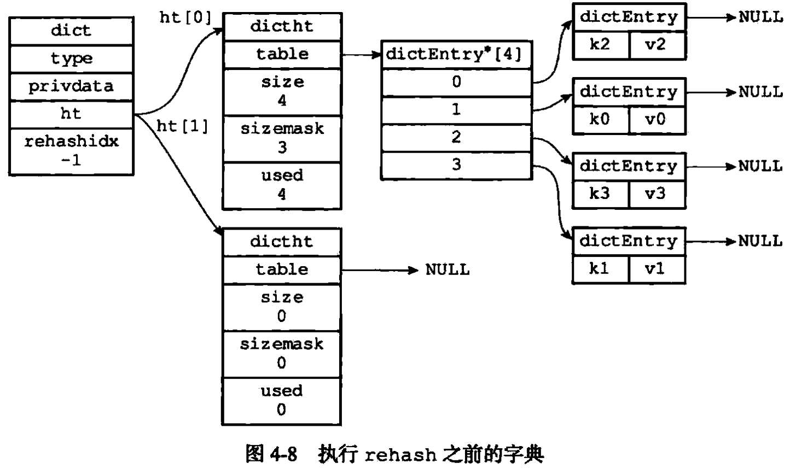
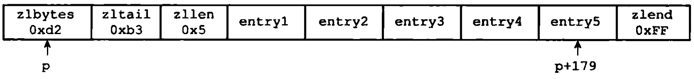
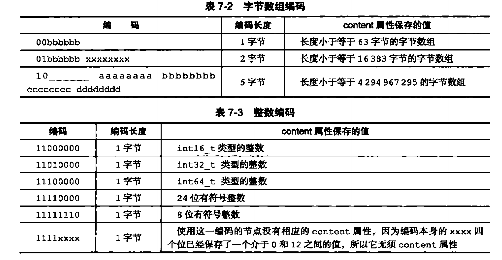
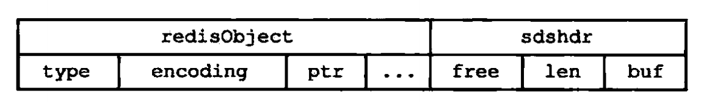
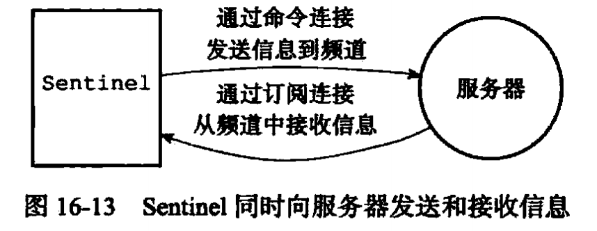
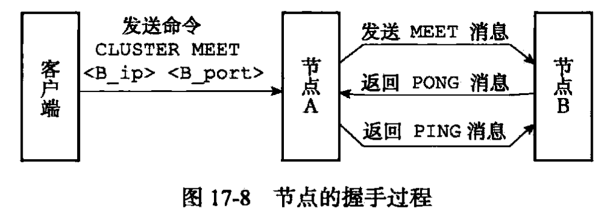
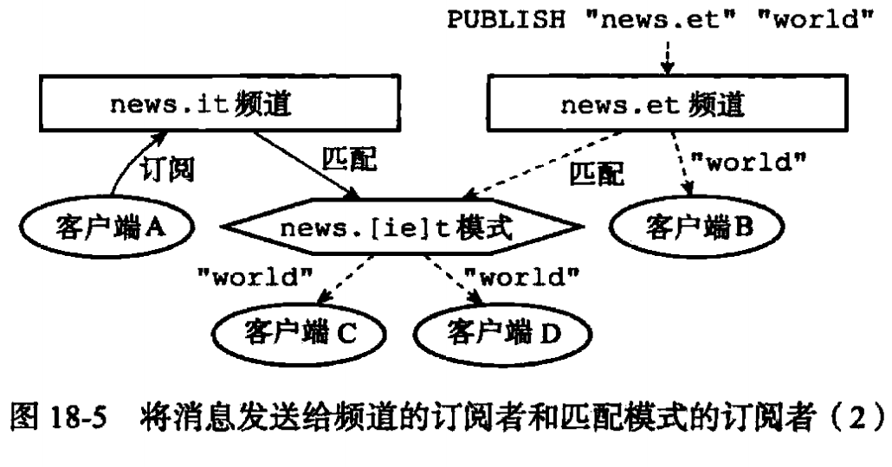
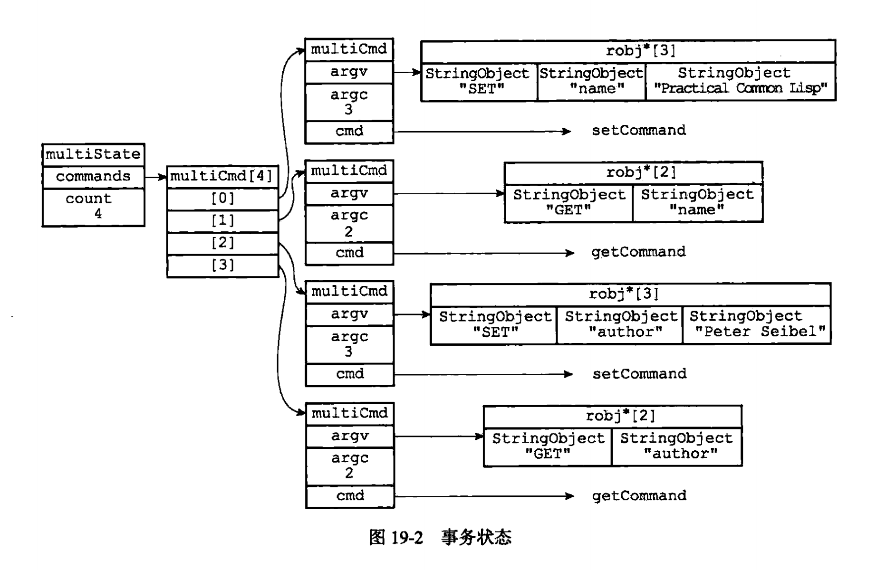

redis
#命令篇
字符串相关命令
append ems word
incrbyfloat number1 3.0 指定的key新增3.0
object encoding key 查看某个key的value对象使用的编码
type key //查看key的value对象的类型


Zrank  key 0 -1
zremrangebyrank  key 0 -1
info replication //查看主从信息
redis-cli -h host -p port -a authPwd
redis-server  config.  
出现RDBversion9的报错，则是低版本不能兼容高版本，删除redis的dump.rdb
auth password
slaveof host port
client list
client setname name
config get *
replconf listening-port 端口          //从服务器向主服务器发送自身的监听端口
replconf ack replication_offset     //从服务器向主服务器发送心跳检测
subscribe <channel>                 //订阅消息
unsubscribe <channel>               //取消订阅消息
psubscribe <pattern>                //订阅模式
punsubscribe <pattern>              //取消订阅模式
publish <channel> <message>         //发布消息
pubsub channels <pattern>           //查看订阅频道
pubsub numsub [频道1 频道2]          //查看对应频道的订阅者，无则返回0
hset
 类似map的东西. hset/hget  map名称 key value
hset person name wang
hget person name 
hset person age 25
hget person age

list
lpush name a b c 从左边塞入数据
则实际的数组顺序是  c b a
同理 rpush name a b c 从右边塞入数据 
则实际的数组顺序是 a b c 

rpop是从右边取一个数据 会删除取出的元素
lpop是从左边取一个数据 会删除取出的元素

lrange name. 0 1 从左边读第0位开始到第1位 这里是读取，并不会删除list里面的元素

sets
自动去重
sadd set 0 1 2 3
smembers set 			读取全部元素
sismembers set 3 		校验是否存在 0不存在 1存在
srem set 0  1			删除元素0 1
scard set				查看元素个数
spop set				随机获取并删除某个元素
smove set set1 2		将set中的元素2移到set1中 
- [x] 为什么不直接 在set1新增2，然后删除set中的2？
因为这样可以保证分布式下的原子性
sinter set set1			两个set的交集
sunion set set1		两个set的并集
sdiff  set set1			读取在set 但有不在set1的元素

sorted set  
可以排序的去重队列		写的时候给每个元素添加分数，然后排序按分数排
用于物流预警队列的用户名单
zadd board 85 li
zadd board 99 wang
zadd board 101 lin
zrange board 0 2	获取最后三名
zrevrange board 0 2 	获取前三名 rev是反转，默认生序，反转后是降序


#应用篇
1、排行榜
2、分布式自增/计数器
3、缓存
4、分布式锁
5、队列
6、去重排序set 用户名单


#原理篇

##数据结构篇
###字符串SDS
目的：压缩内存、安全性、功能性
redis的场景：
1、高性能 高度频繁读写
2、安全性 缓冲区溢出
3、功能性 可以保存图片等二进制文件

SDS的结构
1、len 已使用的字节数
2、free 未使用的字节数
3、buf[] 字符数组

高性能：
1、length的优化
获取长度的复杂度是O(1). c是O(n)
2、减少内存分配
在拼接和截断等操作时，c语言是必然会触发一次内存分配。SDS则是通过预分配和惰性空间释放策略。
加长时，除了增加字符所需的空间，还会额外多分配未使用空间。小于1m，则多分配len一倍的空间。大于1m，则多分配1m.这样最多N次内存分配。
截断时，释放空间也不是直接把内存释放了，而是用free记录一下。可以通过clearAPI去清理内存。

安全性
1、缓冲区溢出
c语言在拼接和截断时，需要手动分配内存，否则会覆盖其他字符串的数据。SDS API则会自动校验，然后分配内存。

功能性
1、需要保存二进制文件
c语言的字符串必须是ASCII码，以空格为结尾，所以不能保存空格数据。这些限制了只能保存文本。
SDS则是保存二进制，数组不再是字符数组，而是字节数组。


###字典
目的：高性能、降低阻塞
字典是类似map的数据结构，保存着多个键值对。但又和Java中hashMap有所不同

dic里有两个类似map的结构，h[0]和h[1];
h[0]是存放数据的数组+链表的map结构
h[1]通常是为null的，只在rehash时，做临时分配的作用

插入
和map的插入一致，先哈希，放数组，冲突用链表解决，头插法放入到链表的头部。因为是单线程，所以头插法不存在链表环的问题。

冲突
链表法+头插法

rehash
在h[1] 中分配或缩小数组空间，*2或者/2。然后遍历h[0]中的数字，rehash放入到h[1]中。完毕后释放h[0],然后将h[0]指向h[1],h[1]仍旧为空。
有点像jvm的复制算法。

渐进式hash
因为h[0]可能会有成千上万个键值对，rehash会耗时很长，而又因为是单线程，肯定会阻塞影响性能。
字典会维持一个rehashIndex,表示h[0]中正在rehash的数组下标。比如为0，表示下次要rehash h[0]的数组中0下标的元素。每次rehash完一个数组元素则+1。
直到rehash完成。
在rehash期间，查询要先去h[0]查询，不在则去h[1];插入应该是直接插入到h[1]中。


###压缩列表
目的:当然是在满足原先列表的功能上,能压缩大小。
功能点:
1、能遍历 通过尾节点向前遍历。
2、能尽力使用空间
构成：
zlbytes:整个压缩列表的字节数
zltail：尾节点距离整个列表的起始位置的字节数，可以看作是尾节点的偏移量.尾节点的内存位置就是列表指针p+该值
zllen:节点数量
entryX:节点
zlend：结尾标志符 OxFF.


节点的结构
previous_entry_length:前节点的字节数，用于计算前节点的起始位置。相当于前一个节点的指针.如果前节点长度小于254个字节，那么这个数值为一个字节，
数值代表前一个节点的字节数。如果前节点大于254个字节，则该数值为五个字节，高位字节为OxFE,表示是个五字节的。
前节点指针的计算公式：p = cur_pointer - previous_entry_length;
```
这是为啥要设置啊？为了规范化，好计算节点的字节数吗？
```
encoding：记录节点类型和长度

content
内容

连锁更新
如果刚好有多个连续的长度是250-253的节点e1,e2,...,en，这些节点的previous_entry_length是一字节。如果这时e1前插入了一个大于253字节的节点，
那么e1的previous_entry_length变成5字节，本身字节数大于254了，那么e2也需要更新。以此类推。这样就产生了连锁更新。

优点：
内存紧凑，无碎片

缺点：
查询效率不高：只有尾节点，遍历靠尾节点向前遍历。因为查找需要遍历，所以一般适用于数量小的场景
连锁更新问题
每次更新，都可能需要申请或回收内存，并且可能引起连锁更新问题

###快速列表
目的：兼容ziplist和linkedlist的优缺点

本质是双向链表+zipList
节点本身就是zipList,然后有前后节点的指针。
问题一：ziplist分配元素过多，那么ziplist会出现更新慢的问题。ziplist分配过少，那么会退化成linkedlist。内存碎片多。
解决方案：配置文件提供list-max-ziplist-size参数。为正数时表示，每个ziplist数据项的最大值。为负数(只能是[-1,-5]区间的数)时，
表示ziplist大小级别。使用者可以根据场景自定义该参数。
问题二：
当链表很长时，最频繁访问的是两端的数据，中间访问频率会较低。比如排行榜，通常也就是访问最高/最低的那几个元素。那其实中间的数据其实可以进一步压缩的。
同样的，redis的配置文件也提供了配置参数list-compress-depth，表示双端各有多少个节点被压缩，为0时表示不压缩，这也是默认值。

```
/* quicklist is a 40 byte struct (on 64-bit systems) describing a quicklist.
 * 'count' is the number of total entries.
 * 'len' is the number of quicklist nodes.
 * 'compress' is: -1 if compression disabled, otherwise it's the number
 *                of quicklistNodes to leave uncompressed at ends of quicklist.
 * 'fill' is the user-requested (or default) fill factor. */
typedef struct quicklist {
  //quicklist表头结构
    quicklistNode *head;//头节点
    quicklistNode *tail;//尾节点
    unsigned long count;        /* total count of all entries in all ziplists */
    //所有的entries个数
    unsigned long len;          /* number of quicklistNodes */
    //quicklistNodes节点个数
    int fill : 16;              /* fill factor for individual nodes */
    //正数时，表示ziplist所包含的最大entry个数
    //负数则有以下意义
    /*
      -1  ziplist大小不超过4kb
      -2  ziplist大小不超过8kb
      -3  ziplist大小不超过16kb
      -4  ziplist大小不超过32kb
      -5  ziplist大小不超过64kb
    */
    unsigned int compress : 16; /* depth of end nodes not to compress;0=off */
      //首尾两端不被压缩节点的个数
} quicklist;
```


###整数集合
目的：节约内存、灵活使用
```
typedef struct intset {
uint32_t encoding;
uint32_t length;
int8_t contents[];
}
```
contents是真正存放数据的，并且该数组是从小到大有序非重复的。数组元素的类型取决于encoding，可以是int8_t、int16_t、int32_t等。

升级
如果新增的元素类型大于当前数组的类型。那么会进行升级。升级主要是分为3步，打开冰。。。不是看下面
1、按最新的类型，扩展数组空间
2、将原有元素类型转换，并有序地重放到新数组上。
3、将新元素放入新数组(新元素是新类型，所以要么是最大，要么是最小。所以位置要么是数组头，要么是数组尾)
由此：插入的复杂度是O(n)。

好处
1、实现了不同类型放到一个集合的兼容问题
2、节约了内存

降级
不可能


###跳表
目的：简单高性能地查找
链表式的平衡树，实现简单。
支持最快查询O(logN)，最坏O(N)
支持范围查询。
有序
redis仅在有序集合zadd里面使用了


###对象
目的：灵活应用，优化各种场景。节约内存。记录访问时间。
每新建一个键值对，都会生成一个键对象和一个值对象。
```
typedef struct redisObject {
//编码
unfigned encoding;
//类型
unfigned type;
void *ptr;
//引用计数
int refcount
//最近访问时间
unsigned lru;
}
```
类型主要分为五种：字符串对象、列表对象、哈希对象、集合对象、有序集合对象。
根据type确定对象
根据type+encoding确定对象的底层数据结构。

为什么要这么做呢？为了灵活定制对象。
如同样是集合对象，如果集合数量小时，用ziplist更合适，数量大时用linkedlist。

####字符串对象
一般是int、raw、embstr三种.
如果保存的是字符串，并且字符串小于等于32字节。那么是采用embstr来保存。raw编码会调用两次内存分配函数分别创建redisobject和sdshdr结构。但embstr
只会调用一次，同时生成redisobject和sdshdr结构。

embstr好处：
1、内存只分配一次
2、释放只释放一次
3、对象和sdshdr是保存在连续的内存，更好地利用缓存优势？？是操作系统的缓存优势吗？

embstr是只读的，所以修改一次以后(哪怕修改之后小于32位)就会变成raw。

####列表对象
编码一般是ziplist或者linkedlist
linkedlist底层是包含上述字符串对象(redisObject+encoding)的
同时满足以下两个条件则使用ziplist
1\列表元素长度都小于64
2、列表长度小于512。
只要不满足其中之一，就会转化成linkedlist
这两个数值可以通过list-max-ziplist-value和list-max-ziplist-entries配置

#####哈希对象
ziplist或hashtable

ziplist怎么实现哈希对象呢？
1、在列表中插入key,再插入value.
2、采用尾插法插入键值对

同时满足两个条件，才会使用ziplist
1、所有键值对长度都小于64字节
2、键值对数量小鱼512。
只要不满足其中之一，就会转化成hashtable
这两个数值可以通过hash-max-ziplist-value和hash-max-ziplist-entries配置

####集合对象
intset和hashtable

hashtable怎么做集合对象
key是字符串对象(embstr、intset、raw)，value则是null

同时满足两个条件，才会使用intset
1、所有值都是整数
2、数量小于512。
只要不满足其中之一，就会转化成hashtable
第二个数值可以通过set-max-intset-entries配置

####有序集合对象
ziplist和skiplist

ziplist怎么做有序集合对象
根据分值来插入，小的靠近表头，大的靠近表尾

以上两种结构都能实现范围查找、顺逆序查找。但如果根据分值查找元素则需要遍历。复杂度是O(n)
因此在上面的基础上加了个hashtable来保存<分值，元素>的映射。因此复杂度降为了O(1)

同时满足两个条件，才会使用ziplist
1、所有元素长度小于64字节
2、数量小于128。
只要不满足其中之一，就会转化成skiplist
这两个数值可以通过zset-max-ziplist-value和zset-max-ziplist-entries配置

####类型检查和命令多态
命令基本是两种，一种是所有键都可以执行的，比如del、expire、rename、type、object，一种是只有特定对象才能执行
命令执行前需要进行类型检查

比如llen，需要能在ziplist或者linkedlist下都能正常返回。这就是命令的多态

####引用计数法回收内存
对，就是那个引用计数

####共享对象
server初始化时会自动生成一些常用对象，比如0-9999。然后需要使用时引用这些对象就好。
当然共享对象通常是简单的对象，比如整数或者字符，因为复杂度分别是O(1)、O(n)。如果是复杂对象，那么验证的复杂度将是O(n^2)

####空转时长
lru:记录该对象最近访问的时间


数据结构总结：
    redis的数据结构最大的特点是节约内存，因为纯内存操作本身已经是非常高的性能，而如果能节约内存则就能获取最大的性能收益了。因此其次才是性能方面。
    同时还兼顾了功能性，以便能实现各种各种的功能，比如排行榜、消息队列等等。以下便是从三个维度下的redis数据结构。
节约内存
    1、emstr和redisObject连续存储
    2、ziplist的极致压缩
    3、intset的升级机制
    4、对象引用回收和复用
    5、quickList的中间节点压缩
高性能：
    1、SDS的预分配、惰性释放、len
    2、skiplist的高效查询
    3、hashtable
    4、emstr只申请一次内存
    5、有序集合中的hashtable结构
功能性:
    1、sds的保存二进制数组，支持图片等
    2、skipList的顺逆序查询、范围查询
    3、intset的兼容
    4、hashtable的渐进式rehash防阻塞
   


####

部署篇

##持久化篇
数据库
redis 默认有16个数据库 客户端默认是选择0号数据库
可以通过select 0-15来选择数据库，数据库之间数据不互通。
数据库健空间：
读写键之后，服务器会做一些默认动作：
1、更新服务器的hit和miss次数，记录命中和缺失的次数
2、更新使用时间 LRU
3、读取时，发现过期了，会先删除，然后再执行其他逻辑
4、watch某个键时，某个键修改后，会被标记为dirty，事务程序会注意到这一变化。
5、每次修改，都会记录该键的dirty次数
6、数据库通知。

键的生存时间和过期时间
expire保存数据库中的所有过期时间
结构仍然是key-value(long long 类型)，设置了过期则有这个key，没设置则无。

过期删除策略
定时删除：过期就删除。内存友好，CPU不友好，因为要经常性的判断是否过期 。影响吞吐和响应。
惰性删除：获取的时过期则删除。 内存不友好，CPU友好。
定期删除：定期清理已经过期的键 折中。
具体实现
惰性：读写命令之前都会执行expireIfneeded.输入是key，如果过期则删除。
定期删除：在serverCorn函数中调用执行activeExpireCycle函数，该函数会随机选取顺序的数据库执行，比如去2、3、4.下次执行时会继续上一步的进度，比如会5678这样子执行下去。

AOF和RDB以及复制功能对过期键的影响
RDB：主服务器启动时，过期则删除。从服务器，无论是否过期都会写入内存。
AOF：在删除过期键之后会追加一条del命令到AOF
AOF重写：过期则不写
复制：主服务器删除之后会给从服务器写入del命令。从服务器读写都不会删除，直到主服务器传来del。

数据库通知：
默认关闭。
subscribe keyspace@0:key.  监听某个key执行了什么命令
subscribe keyevent@0:key	监听某个命令被哪些key执行了。

客户端：

属性：

1、套接字描述符 

fd -1表示伪客户端 比如AOF重放或者LUA 脚本
命令：client list

2、名字
命令:client setname name

3、flag
记录当前状态和角色
REDIS_MASTER 
REDIS_BOLCKED
REDIS_MUTI|REDIS_DIRTY_CAS
REDIS_LUA_CLIENT|REDIS_FORCE_AOF|REDIS_FORCE_REPL

4、输入缓冲区
queryBuf。存放命令

5、命令与命令参数
命令是放在上面的queryBuf上，服务器会解析成argv和argc，
argv:字符数组，[0]表示命令,其他表示参数
argc:命令参数个数


6、命令实现函数


7、输出缓冲区
客户端有两个缓冲区
固定缓冲区：简单回复。有buf 和bufpos.分别是字节数组和已使用的数量

可变缓冲区：固定用完了则开始用可变。reply链表

8、身份验证
authenticated:0 未验证 1已验证

9、时间
ctime:已经链接的秒数
lastinteraction:距离上次互动的时间 也即空转时间
obuf_soft_limit_reached_time:输出缓冲区第一次到达软性限制的时间

客户端创建和关闭
创建：详见上面
关闭：
1、客户端进程被杀死，网络中断
2、发送不符合协议的命令
3、成为client kill命令的目标
4、超过time out限制，即空转时间超时
5、命令请求超过输入缓冲区大小 1GB
6、超过输出缓冲区 
限制策略
硬性限制：超出即关闭
软性限制：超过软性限制大小一定时间后关闭

LUA脚本的伪客户端

一直存在

AOF伪客户端
载入完AOF后关闭

服务器
命令请求执行过程
1、客户端发送命令请求
2、服务端根据命令操作数据库，并产生回复数据
3、服务器将回复数据发送给客户端

发送命令
命令-》协议格式的命令-〉服务器

读取命令
服务器将协议格式的命令读取并放到输入缓冲区，解析命令，拆成argv和argc。然后调用命令执行器。
- [ ] 为什么命令请求处理器在处理时不直接解析到argc和argv里，而是先写入缓存区，再解析呢？

命令执行器


解析出了arg[0] 就可以将cmd指向redisCommand对象了。

执行预备操作
1、如果cmd为null，则说明找不到命令，直接返回错误
2、校验命令参数和实参
3、校验客户身份
4、如果server开启maxmemory功能，则先检查内存
5、LUA超时并进入阻塞，那么只接受SHOTDOWN nosave和SCRIPT kill

调用cmd执行，然后把回复数据放入buf，然后将AE_WRITEABLE事件和命令回复处理器关联。

后续工作
1、若开启慢查询，且是慢查询，则会记录到慢查询日志
2、更新cmd的millissecends,calls+1
3、若开启AOF，则会把命令写入AOF缓存区
4、如果其他从服务器正在复制，则会把命令广播到从服务器。

将命令回复给客户端
cmd已经将回复数据写入到输出缓存区，并将AE_WRITEABLE关联命令回复处理器，当套接字变为可写，则会执行命令回复处理器，将输出缓冲区的回复数据发给客户端。发送完毕之后，清空输出缓冲区。客户端将协议格式的命令回复转换成字符。

serverCorn函数
默认100毫秒执行一次

更新服务器时间缓存
更新unixTIme、mstime

获取系统当前时间，是要进行系统调用的，太多调用会消耗性能。所以对于一些精度要求不高的，可以去获取服务器的时间缓存，比如打印日志，计算上线时间。对于高精度的还是会进行系统调用，如慢日志、过期时间等。

更新LRU时钟


计算键的空转时间就是用lruclock-lru
set key 1
object idletime key
get key
object idletime key //会清零

更新每秒执行命令次数

更新内存峰值记录

info memory
used_memory_human:997.64K
used_memory_rss:663552
used_memory_peak:1039344
used_memory_peak_human:1014.98K
used_memory_lua:35840
mem_fragmentation_ratio:0.65
mem_allocator:libc

处理sigterm信号
sigterm信号会关联sigtermHandler，当sigterm到达时，会设置shutdown_asap = 1。然后服务器就定时查看这个值，为1时则开始优雅关闭服务器。

管理客户端资源
serverCorn每次都会调用clientCorn.clientCorn会进行以下检查
1、客户端超时则释放链接
2、客户端输入缓存区，超过一定大小，则会释放当前缓存区，新建默认大小的缓冲区。

管理数据库资源
databaseCorn。删除过期键，字典收缩等。

执行被延迟的BGWRITEAOF。
在执行BGSAVE期间，BGWRITEAOF会被延迟到BGSAVE执行完毕之后。

如果无BGSAVE或BGWRITEAOF执行，且aof_rewrite_scheduled为1，则会执行被延迟的BGWRITEAOF命令。

检查持久化的运行状态
服务器用rdb_child_pid和aof_child_pid来记录子进程ID。如果为正数，则说明正在执行，如果是-1，则无。
如果有一个不是-1，则会调用wait3函数。检查子进程是否有信号发给服务器进程。有信号，则说明RDB或者AOF重写完毕，则进行后续动作，比如新的RDB替换现有的RDB，用重写的AOF替换现有的AOF。
如果都是-1，则
1、检查aof_rewrite_scheduled是否为1，1则进行BGREWRITEAOF
2、检查自动保存条件是否满足，满足且没有其他持久化，则BGSAVE。
3、检查AOF重写条件是否满足，满足且没有其他持久化，则BGREWTRITEAOF


将AOF缓冲区的内容写入AOF文件

关闭异步客户端
关闭输出缓冲区超过大小的客户端。

增加cornloops计数值
cornloops唯一作用是在cornloops达到某个次数的时候执行某些代码

初始化服务器
1、初始化状态，创建一个redisserver作为服务器的状态，也会创建命令表。initServerCOnfig
2、载入配置选项 载入配置文件，或者输入的配置
3、初始化数据结构，如clients、server.lua 、db、slowlog。initServer,初始化并分配内存，赋初值。
还包括：
	3.1设置进程信号处理器
	3.2创建共享变量，“OK”“ERR”等全局变量
	3.3打开监听端口，并为套接字关联应答处理器
	3.4为serverCorn创建时间事件
	3.5AOF开启则打开现有AOF文件，不存在则创建新的AOF
	3.6初始化IO模块
4、还原数据库状态
AOF或RDB还原
5、执行事件循环


RDB:
持久化数据
数据库状态：内存中的非空数据库以及健值对称之为数据库状态

所谓RDB持久化就是将数据库状态转为RDB(dump.rdb)文件以及将RDB转为数据库状态的过程。

保存对应命令是
save:阻塞redis服务线程，直到rdb文件生成完毕
bgsave：fork一个子进程去保存rdb
载入
载入是启动时自动载入，只要有rdb文件，redis启动时就会自动载入
值得注意的是AOF的频率通常是更快的，如果开启了AOF，启动时则会优先使用AOF来载入。只有AOF关闭的情况下才会使用RDB载入。
BGSAVE期间，客户端的save、bgsave命令会被拒绝.这是因为会有resave子进程竞争。bgsavewaitAOF则会被阻塞到bgsave执行完再执行。

AOF ：
持久化命令

具体实现：命令追加、文件写入、文件刷盘
命令追加：数据写入到redis_sercer中的aof_buffer
文件写入：aof_buffer(内存)写入aof文件(内存中)
文件刷盘：aof持久化到磁盘

刷盘策略  appendfsync
	1、always 实时刷盘 可靠性最好，性能最低
	2、no 异步刷盘 由操作系统决定写aof时机 可靠性最差，性能最高
	3、everysec 每秒刷盘 以上的综合 默认
载入
服务器伪造一个client然后从aof中解析命令，然后执行。效果和真实的client一样。真是个小机灵鬼！
重写：
将AOF文件压缩，原理就是两个set最终的结果和最后一个set一致，所以可以只保存最后一个set。
具体实现不是将AOF读取解析压缩。而是对当前数据库状态复制为AOF文件，这样肯定是没有一条命令是多余的。这又是一个小机灵鬼。
当然如果键值对很大，比如zset里有很多个元素，那么其实是会拆分成多个zset命令。
重写都是在子进程里面执行的。
- [x] 在AOF重写时，服务进程会有新的数据进来，如何处理这个冲突呢？

重写期间，服务进程在写入aof缓存区的时候，也会写入到aof重写缓存区。子进程完成AOF写入动作之后，会给信号给服务进程。服务进程开始将AOF重写缓存区的内容

事件篇
时间事件和文件事件
时间事件：某些需要定时执行的操作
文件事件：服务器是通过套接字与客户端、其他redis服务器通信的。对套接字的操作事件称之为文件事件

文件事件：
redis基于reactor开发了自己的网络事件处理器，这个处理器称之为文件事件处理器，简称FH吧。
FH监听多个套接字(多个tcp端口吗？)，并根据套接字的内容关联不同的事件处理器。
被监听的套接字准备执行应答、读取、写入、关闭等操作时，就会产生对应的文件事件，FH则会把这些事件交给关联好的事件处理器来处理。
文件事件处理器FH是单线程的。
文件事件处理器是由套接字、IO复用程序、文件事件分派器、事件处理器构成的。

套接字会放到复用程序里面的队列里。复用程序会有序、同步、一次一个的方式传送给文件事件分派器。处理完上一个套接字才会传送下一个。处理器则是一个个函数组成喽。
事件类型：
AE_READABLE:可读事件，对应于客户端对套接字的write、close、应答时的connect。
AE_WRITABLE:可写事件，对应客户端对套接字的read操作。(客户端要读取套接字，所以服务端需要写入数据)
套接字同时出现可读可写，服务器会优先读套接字(AE_READABLE)，后写套接字。
文件事件处理器：
应答处理器
命令处理器
回复处理器：命令处理完的回复
复制处理器：主从复制的
整个流程：
监听状态下AE_READABLE事件是跟应答处理器关联
客户端发起链接请求，产生ReadAble事件，然后出发链接应答处理器，创建套接字，然后将READABLE事件与命令处理关联。客户端发送命令请求，服务器将将产生一个READABLE事件，然后触发命令处理器。然后将WWRITEABLE事件与命令回复处理器关联。客户端读取读取命令回复时，服务器产生WRITEABLE事件触发命令回复处理器
，写完之后接触关联

总结：
REABLE-》应答 
READABLE-〉命令处理。 WRITEABLE-》命令回复

时间事件：
周期事件：周期执行的事件 serverCorn
定时事件：只用一次的事件
一般只有serverCorn事件

调度
服务就是不断是处理文件事件和时间事件，直到服务器关闭。


多机数据库

复制篇：
旧版复制的实现
同步：sync 将从服务器更新至主服务器最新的状态
命令传播：commond propagate 主从不一致时，重新恢复到一致

slaveof是先执行同步
同步
从服务器发送sync命令到主服务器，主服务器收到后执行BGSAVE生成RDB文件，同时开辟一个缓冲区记录执行期间的所有写命令，执行完毕后，将RDB文件发给从服务器，再将缓冲区的命令发给从服务器，从服务器开始载入RDB和缓冲区命令。

- [x] 这个RDB是整个master的RDB文件吗？如果过大会怎么处理呢？
是整个RDB文件，再大也是发送整个RDB文件。这个就是旧版复制的问题，比如断线重连之后，依旧会主服务器整个RDB文件发送过来，实则无必要，因为只需要主服务器命令传播短线之后的写命令就好了。

命令传播
主服务器会将写命令传播给从服务器。

旧版的问题
复制分为两种情况：
初次复制
断线重新复制
断线重新复制也需要重新生成(cpu、内存、磁盘)、传送(网络)、重放(cpu、内存、磁盘、不可用)整个RDB文件，重复且低效。

新版PSYNC
初次复制和旧版一致
部分重同步：短线重复制改为从服务器向主服务器发送PSYNC命令，主服务器收到后回复CONTINUE，然后发送断线期间的命令，从服务器收到CONTINUE之后，开始准备重新执行短线期间的命令。

- [x] 如果找到断线期间的命令呢？或者如果判断出断线了，并且如何存储这些断线期间的命令？不同的从服务器断线又要怎么处理？
答案看下面👇

部分重同步的实现
主要有三部分：
主服务器的复制偏移量和从服务器的复制偏移量
主服务器的复制积压缓冲区
服务器运行ID

复制偏移量
主从都会维护自己的复制偏移量
主服务器每次传播N个字节，复制偏移量都会+N
从服务器收到N个字节，复制偏移量都会+N。
- [ ] 这里是收到还是执行完才+N？

复制积压缓冲区
主服务器会维持固定长度、先进先出的队列。默认是1M
命令传播时，会将命令写入复制积压缓冲区。

主服务器收到PSYNC之后，会判断从服务器的偏移量+1之后的数据是否在积压缓冲区，在则部分重同步，将偏移量+1之后的数据发给从服务器。不在则完整同步。
感觉这个会有缺陷：比如如果断线期间写的命令过多，重连时间较长，导致偏移量+1刚好不在积压缓冲区，那么就会进入重同步。所以这个缓冲区的大小设置很重要。
一般是2 * 重连时间 * 平均每秒写入数据的大小。

服务器运行ID
每个服务器都会生成自己的运行ID，ID是40随机十六进制组成。
当从服务器初次复制主服务器时，从服务器会保存主服务器的运行ID。断线重连之后，如果从服务器发现自己保存的ID与现在链接的主服务器ID不一致，则会完整重同步。如果一致，则进行部分重同步。

PSYNC的具体实现
调用时机
1、从服务器没有复制过任何一个主服务器(比如offset为0？主服务器的runid不为空？)或者slaveof no one.那么从服务器会发送一个psync ？ -1,主动请求主服务器完整重同步
2、复制过的话，则发送psync runid offset。主服务器会根据情况进行处理

主服务器的回应有三种
1、FULLRESETSYNC runid offset   offset是主服务器当前复制偏移量，从服务器将这个作为初始偏移量(会进行完整重同步)
2、CONTINUE 部分重同步，从服务器等待接受缺少的部分数据即可
3、-ERR 表示主服务器版本低于2.8，从服务将发送sync进行完整重同步


复制的具体实现
1、从服务器设置主服务器的IP 端口
2、建立套接字链接 从服务器具有server和client(主服务器的client)的属性
3、发送PING命令 (和平常的ping不一样)
ping 
“pong”正常的回复
作用：
	检查套接字的读写状态
	检查主服务器是否能够正常处理从服务器的命令
主服务器的回复
	1、正常且在规定时间内(timeout)回复 PONG 		则继续下一步
	2、正常但没在规定时间内回复PONG 			重新创建套接字
	3、返回错误，比如主服务器在处理超时的LUA脚本 重新创建套接字
4、身份验证
主服务器没有设置requirepassword,从服务器也没有设置masterauth，则进行下一步
主服务器设置了require password ，从服务器也设置了masterauth 且密码正确	下一步
主服务器设置了require password ，从服务器也设置了masterauth 且密码不正确	重新创建套接字
主服务器没有设置require password ，从服务器设置了masterauth 	重新创建套接字
5、发送端口信息
 目的是让主服务器能联系上从服务器
replconf listening-port 端口 。主服务器会在redisObject上设置slave_listening_port端口
6、同步
在执行PSYNC或者SYNC命令之后，主服务器也成为了从服务器的客户端
PSYNC需要主服务器发送复制积压缓冲区的命令发送给从服务器
SYNC需要主服务器发送缓冲区的命令给从服务器
7、命令传播

心跳检测
每秒
replconf ack offset 
作用：
1、检测主从的网络情况
2、辅助实现min-slaves选项
3、检测命令丢失	即查看主从是否一致

1、检测网络状态
在主服务器使用info replication中的lag选项则是距离该slave上次发送ack的秒数

2、辅助min-slaves选项
主服务器会配置
min-slave-to-write 3 
min-slave-max-lag 10
则表示如果从服务器数量小于3 或者从服务器的lag都大于等于10(表示所有主从网络都很差)，则拒绝执行写命令。

3、检测命令丢失
如果offset的数字小于主服务器的offset，则表明从服务器的命令少于从服务器，即存在传播命令时丢失，主服务器则会从复制积压缓冲区取出缺少的命令补发给从服务器。
- [x] 如果从服务器发送ACK还没到达主服务器之前，主服务新增了一些写命令，并且命令传播出去了，这时ACK才到达主服务器。主服务器这时会补发新增写命令，这不是会造成命令重复传播吗？怎么解决
个人想法时，命令都有offset，如果从服务器的offset大于重复传播命令的offset，那么从服务器将这些命令丢掉即可。
- [x] 2.8之前没有offset一说，所以要保证命令不丢失，还是选择2.8以上的吧。
与部分重同步的区别
补发数据是在主从没有断线的情况下执行的，部分重同步是在主从断线之后才执行的
- [x] 主从服务器其实是一种特殊的客户端

sentinal
redis高可用的一种方案，sentinal是独立的节点，负责监听主从节点，当master宕机下线时，sentinal会选取从服务器重新作为主服务器，保证主从结构。
如果原先的master重新上线，则会退化成slave。
启动sentinel
redis-sentinel redis-sentinal.conf 或者 redis-server redis-sentinal.conf —sentinal

启动过程
1、初始化服务器
2、将普通server代码替换成sentinel代码 ？？？
3、初始化sentinel状态
4、初始化sentinel监视的主服务器列表。
```
从服务器呢？从主服务器那里拿吗？
是的，通过向主服务器发送命令，动态获取从服务器的信息。
```
5、创建连向主服务器的网络连接。

1、初始化服务器
sentinal只是特殊的server，但也并不执行某些操作，比如部分命令，重载RDB或AOF
2、替换sentinel代码
其实就是不加载某些变量以及命令列表，比如端口之类的。这也是端口不一致和不执行某些命令的原因
3、初始化状态
初始化一个sentinelState结构
属性
current_epoch//当前纪元 用于故障转移
dict *masters  //key-value模式 key是名称 value是指向sentinelRedisInstance结构的指针
tilt //
tilt_start_time //进入到tilt模式的时间
running_scripts //正在执行的脚本数量
scripts_queue//所有脚本
4、初始化masters属性
创建两个异步网络链接
1、命令链接
2、订阅链接
专门订阅sentinel：hello频道
为什么要有两个链接？还是异步的？
因为订阅和发布的功能中，redis不存储发送的信息，为了不丢失sentinel：hello频道的信息，专门弄一个链接接受。异步是因为sentinel会链接
很多服务器，所以得是异步的。 
那如果这个订阅链接挂了呢？频道信息不还是丢失了吗？

获取主服务器的信息
sentinel每隔10秒发送一部分info命令获取主服务器和slave信息
info server
info replication

主要是两方面信息
1、主服务器本身的信息
2、slave的ip和端口，自动发现slaves

主从服务器在sentinel中的结构都是sentinelRedisInstance,区别在于
主服务器的结构flags是sri_master,从服务器是sri_slave
主服务器里的slave是保存了slaves字典的
主服务器实例里的name是由sentinel.conf里面配置得来的，slave的name是sentinel自动动态设置的。

获取从服务器的信息
在通过主服务器获得端口和ip之后，sentinel也会和slaves建立两个链接，命令和订阅。也是每10秒一次发送info命令
info server
info replication

从而获取
1、run_id
2、role
3、从服务器的master_ip、master_port
4、master_link_status
5、优先级slave_priority 
```$xslt
这是用于选出新master用的
```
6、复制偏移量slave_repl_offset

向主服务器和从服务器发送信息
sentinel每两秒发送一次，通过命令链接向所有主从服务器的sentinel_:hello发送publish命令
发送内容:s_开头是sentinel信息，m_开头是主服务器信息。
---
m_开头的信息应该是每个主从集群一样吧，不同的集群之间收到的信息，仅仅是m_开头的信息不一样？？
---
s_ip
s_port
s_runid
s_epoch
---
这里的s_epoch是全局只有一个还是每个主从集群各有一个？
猜测是全局一个，每个主从集群出现故障转移都会加一
---
m_name
m_ip
m_port
m_epoch
---
这里的epoch会和s_epoch数值一样吗？ 
---

接受主从的频道信息
通过订阅链接发送subscribe sentinel:hello命令接受信息
对于监视同一个服务器的多个sentinel来说，一个sentinel会同时接受到其他sentinel在sentinel:hello频道发布的命令。
既会更新其他sentinel对发布消息的sentinel的认知，也会更新其他sentinel对服务器的认知？？很文字，不数据。

sentinel接受到其他pubslish信息之后
1、发现运行ID和自己一样，则丢弃
2、不一样，则更新该主服务器实例的数据。
---
如果出现AB发送，BA接受问题？这个要怎么解决呢？
时间戳或者offset
---
1、更新sentinels字典
sentinels字典是redisServer里面的属性
结构是key-value形式，key是""ip:端口"，value是sentinelRedisInstance指针
如果频道收到的信息主要是是sentinel信息和master信息
2、创建其他sentinel的命令链接
监听同一个master的sentinel最终会两两互相关联。值得注意的是sentinel只会建立命令链接，而没有订阅链接。因为订阅链接本质是广播
和接受广播，之前已经通过主从建立了订阅链接，相当于sentinel已经能广播和接受广播。因此没必要建立订阅链接。



检测主观下线
sentinel会向所有建立命令链接--包括master、slave、其他sentinel发送ping命令
命令回复分为
1、pong、loading、masterdown等有效回复
2、其他无效回复或者没有在指定时间内回复
如果在down-after-milliseconds毫秒内没有收到有效回复，那么sentinel会标记该实例为主观下线，具体做法是在sentinelRedisInstance
里的flag里添加SRI_S_DOWN标示。
---
这里sentinel应该会在sentinelRedisInstance设置一个上次有效回复的时间戳，每次收到有效回复都会更新这个值。
---
这里的down-after-milliseconds是针对master、slave、sentinel都是有效的
不同的sentinel设置的down-after-milliseconds可能不同，也就是说一个实例，比如master，在不同sentinel里的主观状态可能不同
有的是主观下线，有的是还在线。

检查客观下线
当sentinel标记为主观下线之后，会向其他sentinel询问是否被标记为主观下线，如果一定数量(quorum值)的sentinel都标记为主观下线，则认为是客观
下线。如果标记的是从节点那么，到此为止，并不会发生选举过程。除非是master，才会出发选举

1、发送sentinel is-master-down-by-addr ip port epoch runid
runid：不是被标记为下线的服务器runid，取值只有*---仅用于检测客观下线的情况和sentinel自身的runid---用于选举头sentinel

2、接受sentinel is-master-down-by-addr ip port epoch runid命令
收到之后将会回复三个参数
    1、down_state  当前sentinel对主服务器的检测下线状态
    2、leader_runid  *---仅用于检测目标服务器的下线状态 当前sentinel的局部头sentinel的runid
    3、leader_epoch  局部头sentinel的纪元，仅在leader_runid不为*时生效
---
这里只会同步master的主观下线状态吗？slave、sentinel会这样同步吗？
---    

选举头sentinel
规则
1、监视同一个master的多个sentinel都有机会成为头sentinel
---
如果sentinel监视不同的master，那么epoch是多个还是一个？
---
2、无论是否选举是否成功，epoch都会加一
3、一个纪元里只有一个sentinel会成为头sentinel，并且设置之后不会修改。
4、每一个发现客观下线的sentinel发起投票，比如现在有三个sentinel监听m,那么s1、s2先后发现m客观下线，则s1、s2都会向其他发起
sentinel is-master-down-by-addr ip port epoch 自身runid，让其他sentinel选自己
5、先到先得，在一个epoch里面，一个sentinel只会设置一个头sentinel，也就是同一个epoch里，同一个sentinel收到不同sentinel命令
只会回复第一个sentinel的runid作为头sentinel
6、如果候选者sentinel收到(>=quorum且n/2+1)的投票，则会成为头sentinel

sentinel超时机制
failover_start_time：下一选举启动的时间。默认是当前时间加上1s内的随机毫秒数。修改时机为故障转移开始---观察到客观下线之后和
投票请求时
election_timeout：选举超时时间
failover_state_change_time 故障转移中状态变更的时间。
failover_timeout 故障转移超时时间。默认是3分钟。

---
候选者成为头sentinel之后，会广播出去吗？或者其他sentinel如何得知选举已经成功了呢？
会，但是sentinel是先干活，然后等明确了新master之后会更新config_epoch,然后通过hello频道广播出去，其他sentinel收到新的epoch之后
会更新自身的epoch。相当于广播了。
---
---
没有标记为主观下线的sentinel如何得知监听的master被标记为客观下线呢？
比如有五个sentinel，其中三个已经标记master为主观下线，并且已经发送sentinel命令向其他sentinel确认master客观下线了。但另外两个
未标记为主观下线的sentinel如何得知master已经客观下线了？？这两个会发起投票吗？
只有发现客观下线的sentinel才会成为candidate,其他sentinel是个follower。
---
---
怎么判断选举失败？什么时候发起二轮选举？
当候选者超过election_timeout之后没有成为头sentinel，那么会成为follower。等待failover_timeout超时才会再一次发起选举。
等待期间是follower状态。
---
每次客观下线都会选举新的leader，进行故障转移

```$xslt
raft算法
角色
leader：
follower：
candidate：选举的中间角色

任期：
每个节点都又一个term值，一个term内只有一次选举。

一般是只有leader、follower。leader故障，会引发选举。比如follower一定时间内未收到leader消息，则会发起选举。

选举前的动作
1、term+1
2、设置开始时间和选举超时时间(一般是随机)
3、投自己一票
4、发起投票
5、选举过程一次term只能投一票。
选举超时未成为leader，则转为follower，等待更新一轮term的投票或者当前选举leader的广播消息。
```

故障转移
1、从旧master下属的slave中选择一个作为新的master
2、将其他所有slave的主服务器设置为新的master
3、将原来的旧master的主服务器设置为新的master
```$xslt
在原先从服务器设置新的master时，是否会触发同步？
```

1、选新的master
选取状态好的，数据完整的从服务器，然后发送slaveof no one。将其转化为master
```$xslt
怎么挑选呢？
将所有的从服务器放到列表里，然后遍历
1、删除下线的
2、删除最近五秒内没有回复头sentinel的info命令的
3、删除和主服务器断开链接超过down_after_milliseconds *10 毫米的。即删除最早与原master断开的slave
最后选取优先级最高、复制偏移量最大的从服务器，如果有多个，则选择runid最小的---随便选了。
```
选出之后就发送slaveof no one 给目标master。然后每秒一次地发送info replication，直到确认role变成master了

2、修改其他从服务器的master
向其他slave发送slaveof 命令即可

3、将旧的主服务器变成从服务器
旧master上线之后，sentinel发送slaveof 就行了。


集群
集群通过分片进行共享，并且有复制和故障转移的功能


节点
cluster meet ip port 
可以将目标node添加进源节点所在集群
节点和redis服务器启动方式不一样，通过conf中的cluster-enabled yes开启

节点保留了redis服务器的功能
同时新增了clusterCorn函数，新增clusterNode、clusterLink、clusterState三种数据结构

clusterNode
创建时间
名称
纪元
flags       //REDIS_CLUSTER_NODE
ip
port
clusterLink指针

clusterLink
创建时间
fd          //tcp套接字描述符
sndbuf      //输出缓冲区
rcvbuf      //输入缓冲区
clusterNode //无则null

clusterNode与redisClient
都有自己的套接字描述符、输入、输出缓冲区。区别在于一个是链接节点，一个是链接客户端

clusterState
clusterNode指针
currentEpoch    //当前纪元
state           //在线状态
size            //??
nodes指针        //字典型，key是名称 value是clusterNode

cluster meet


命令到达A之后，首先A节点会创建clusterNode结构，并加到nodes字典里，然后向B发送meet消息
B收到之后，也会创建clusterNode，并加到nodes字典里，并返回一个pong消息给A，表示已收到消息。
A收到pong消息后，会再次发送ping消息给B，向B表示已经收到消息了。之后节点A会通过gossip协议把B的信息传给整个集群
类似三次握手


槽指派
集群的整个数据库氛围16384个槽，每一个键都属于其中一个。当每一个槽都有节点在处理，则集群状态为在线，只要有一个不在，则认为是下线。
cluster addslots 0 1 2 3 ... 10000

1、记录slot信息
unsigned char slots[16384/8];
int numSlots;
2、传播slots
每个节点都会传播自己的slots数组消息，每个收到的节点都会在nodes里面记录这些消息。
3、记录集群slots的指派消息
在clusterState里有
    clusterNode *slots[16384];
slots[i]指向分配的clusterNode节点 为null则未指派; 
这是为了在知道整个集群的slot的分配信息以及分配给那个slots时，能以O(1)的速度得知。
4、cluster addslots 具体实现
    遍历输入值，如果state中slots有一个不为空则返回已分配错误
    然后将state.slots里的slot分配出去
    将当前节点的slots分配出去
    群发分配结果
```$xslt
如果这时集群里同时有两个分配指令，是不是出现重复分配问题呢？
```

在集群里面执行命令
所有槽的分配出去后，集群处于上线状态，这时就可以执行命令了。
    如果当前槽正好是自己处理，则直接执行命令
    如果是其他节点，则会返回MOVED错误，指引客户端转向正确节点，然后再次发送命令。
1、计算槽
CRC16之后&16384
cluster keyslot "key"
2、判断是否是当前节点执行
state.slots[i]是自己，则执行命令。不是则根据state.slots[i]指向的clusterNode返回给客户端。
3、MOVED
MOVED slot ip:port

集群模式的客户端会识别MOVED错误，并自动转向。
单机模式下的客户端无法识别，也无法转向。

节点数据库的实现

重新分片
在新增节点时会触发重新分片，这一切的动作都是redis-trib做的
1、redis-trib向目标节点发送cluster setslot <slot> importing <source_id>,让目标节点准备import某个slot的键
2、redis-trib向源节点发送cluster setslot <slot> migrating <target_id>,让源节点准备好迁移
3、redis-trib向源节点发送cluster getkeysinslot <slot> <count> 从源节点获取最多count个slot的key
4、对于每一个key，redis-trib都向源节点发送migrate target_ip target_port key 0 time_out
5、重复3、4
6、redis-trib向集群发送cluster setslot <slot> NOde target_id 广播已经分配好了
```$xslt
为什么源节点不直接向目标节点migrate呢？

如果在重新分片的cout命令之后，对应的slot又新增了key怎么办？count成为了旧值怎么办？
```

ACK错误
在迁移过程中，如果来了操作迁移槽的命令到源节点上。
如果有，则直接返回给客户端，如果没有，则返回ACK错误，指引客户端去目标节点执行。

ACK错误和MOVED错误
1、MOVED错误是表明A->B已经迁移完了，以后的该slot的命令都去B执行，不必再经过A转发
2、ACK错误是表明正在迁移，之后该slot的命令还是到A中执行，除非收到MOVED。因为ACK只表明正在迁移，可能部分的key还是存在A中，所以还是需要先到A执行


集群的故障转移和复制

复制
可以用cluster replication <master_id> 让执行命令的节点成为master_id的从节点
```
集群模式下的slaveof 
```
从节点会修改clusterState中的信息，然后在同步信息的时候会逐渐被其他节点得知。
设置从节点
    cluster replication master_id
    将clusterState.myself.slaveof指向master的clusterNode
    修改clusterState.myself.flags的REDIS_NODE_MASTER为REDIS_NODE_SLAVE
    slave节点开始复制，相当于SLAVEOF 
    广播出去
    之后集群内所有的节点中，关于master的clusterNode里面的slaves都会指向该master的所有slave的clusterNode。

故障转移
故障检测
如果某个节点在ping时发现主节点疑似下线(flags置为PFAIL)了，那么会开始统计其他主节点的检测信息，如果半数以上的master都认为主观下线了。则认为是客观下线(FAIL)了
```
这里只有master的节点才能参与统计，从节点就算观察到其他节点下线了，也不纳入统计
```
开始广播FAIL消息告知下线了，收到消息的节点也开始修改为FAIL状态。

故障转移
从节点发现主节点下线，从节点会对下线主节点进行故障转移
```
这里的发现是指其他master广播了FAIL消息吗？如果

这里的选举会有一些缺陷，这里是最先获得FAIL消息的slave最有可能选举成功。而这个slave很可能是复制量最少的，也就丢失了一些数据。另外如果复制量少的
slave成为了master，那么其他复制偏移量比它高的slave，在复制的时候，是完整的同步还是部分重同步？貌似无法部分重同步，只能完整同步，那完整同步可不
就是会造成浪费喽？
```
1、选举主节点节点
2、选中的slave执行slaveof no one 成为新master
3、新master撤销之前的槽指派，将槽指向自己
4、新master广播pong，告知其他节点
5、新master开始接受和处理槽的命令

选举主节点
从节点发现客观下线，向其他master发起投票，选举自己，如果选举成功则成为新的master。否则等待时间，然后继续新一轮选举，直到选出新的master。
```
这里发现客观下线应该是指slave收到了FAIL消息
```

消息
五类消息
MEET消息:新增集群节点的命令
PING消息：每秒从节点列表中随机选五个，再挑选其中最长时间发送过ping消息的节点发送，确认是否在线。如果A收到B的PONG消息时间超过设置的cluster-node-timeout
的一半，也会发送ping消息
PONG消息：收到MEET消息和PING消息后，会回复PONG消息。当处理故障转移后的slave也会广播PONG，表示自己是新的master.
FAIL消息：当主节点观察到某个主节点客观下线后会广播一条FAIL消息，告知集群该主节点已下线。收到FAIL消息的slave会进行选举。
PUBLISH消息：收到publish命令的节点会广播一条PUBLISH消息，让其他节点也执行publish命令。即一个命令，n-1条publsh消息。
```
注意区分publish命令和publish消息。为什么不直接广播publish命令呢？这是因为节点之间是通过消息来进行通信的，广播消息更符合这个设定。
```

消息
消息是由消息正文和发送者的信息组成。
clusterMsg:消息结构
clusterMsgData：消息正文结构
clusterMsgDataGossip:记录着被选中节点和当前节点的一些信息
 

MEET、PING、PONG消息的实现
这三个命令每一次发送都会携带两个clusterMsgDataGossip(集群其他节点的信息)。接收者如果发现如果已经和这些其他节点握手，则更新即可。没有则进行握手。
```
gossip每次只能携带两个节点信息，如果集群规模很大，那么集群内的信息更新会存在很大的延迟。通常需要一定的时间才能全部广播完
```

FAIL消息的实现
clusterMsgDataFail只记录着下线节点的名称，因为集群的所有节点的名称都是唯一的，所以每个节点都可以根据名称找到对应clusterNode

pubslih消息的实现
    


频道的订阅和退订
订阅关系会保存到pubsub_channels字段，结构仍然是dict结构，key是频道名称，value是redisClient链表。
1、订阅频道
频道存在，则尾插法
不存在，则创建后插入
2、退订
遍历链表，删除redisClient
删除后为空，则删除频道键

模式的订阅和退订
模式的关系是保存到list pubsub_patterns字段
pubsubPattern是有redisClient和partern字段组成

psubscribe的流程基本就是
遍历所有输入的模式
然后生成pubsubPattern对象加入链表中
```
一个client可以绑定多个pubsubpattern吗？
这个绑定的关系不能优化成dict结构吗？key是client,value是模式list？
不能，因为到时不好模式匹配。得遍历整个dict

```

punsubscribe
从pubsub_patterns找到client相同且模式相同的节点，删除即可

发送消息
publish channel message
频道发送消息：其实就是遍历pubsub_channels找到频道对应的client列表，发消息即可
模式发送消息：遍历整个pubsub_pattern列表，找到匹配的模式，然后发送消息

查看订阅消息
pubsub channels [pattern]
原理就是遍历整个pubsub_channels

pubsub numsub [频道1 频道2]

pubsun numpat 


事务篇
事物原理，将命令存储到事物队列并且返回queued，然后遇到exec命令，则开始逐个执行。

结构是redisServer里面的multiState
multiState保存了multiCmd链表和链表长度
multiCmd是一个由参数、参数数量、命令指针组成的



watch命令的实现
watch 可以监听某一个键。在multi之前watch事务里面的键,如果在exec之前该键被其他客户端修改了，则exec会失败。
原理：
redisDb里面保存着watched_keys的字典结构，key是watched的键，value是client链表
每次遇到修改的命令，watch都会触发一次。
遍历watched_keys，找到被修改的key,然后遍历clients添加client.flag为REDIS_DIRTY_CAS.
exec执行时会根据flags判断，如果有REDIS_DITY_CAS，则拒绝执行。

```
这个watch貌似只会生效一次，如果第一次exec已经拒绝执行、正确执行、其他原因执行失败了，那下次无论其他客户端是否修改这个key，第二次的exec都会成功。
也就是一次exec的执行，会让watch失效。
client1                 client2
watch key2
multi
set key1 value1
                        set key2 value2
exec
这个例子里exec也是会失败的。原因是watch其他键，其他键被修改之后也会把redisClient的flags的REDIS_DIRTY_CAS打开，从而判定exec无效
所以使用的时候一定要保证watch的是multi里面的键。
好鸡肋的watch机制啊。。。。
```

事务的CAID性质

1、原子性：要不任务队列全部执行，要么一个都不执行。
队列中的命令存在命令性错误，比如错误的命令名，则不会执行    具备原子性
队列中的命令存在语法错误，比如错误的参数个数，则会部分执行   不具备原子性 且无法回滚


```
但其实如果命令部分执行失败，部分命令执行成功。这时redis是不会回滚的。这算是原子性吗？
```


2、一致性
能从一个正确状态转到另一个正确状态
？？？


3、隔离性
串行执行，天然是隔离的。

4、持久性
    无RDB和AOF，无持久性
    RDB下，因为不能立马执行save,并且bgsave是异步的。所以不具备持久性
    AOF appendfsync开关是always时，具备持久性 no或者everysec都不具备


LUA脚本
LUA脚本是c语言开发的一个脚本，可以内嵌到各个操作系统中。


- [x] 定时删除策略是产生一个时间事件吗？
是的。但因为时间事件是一个无序链表，所以查询耗时是O(n).尽量还是不要吧
- [x] 从服务器在遇到读取过期键时，是返回空值还是过期值。
返回过期值。
- [ ] 从服务器是不是根本就没有过期策略啊，因为从服务器对数据没有更改的权限？
- [ ] 客户端的输入缓冲区和输出缓冲区存放什么
命令和回复的数据
- [ ] redisClient结构中只有一个argv和argc，也就是只能存储一个命令，那如果要多个命令，要怎么实现呢？
命令是先存放在输入缓冲区，然后挨个解析命令到argv和argc，新到的命令写入输入缓冲区就好了。缓冲区的清理是在serverCorn中的clientCorn里面。可能还会记录已经解析offset。
- [x] 这些延迟的BGWRITEAOF命令是记录在哪里的？

- [x] 服务器又是怎么判断BGSAVE或者BGWRITEAOF在执行？
服务器用rdb_child_pid和aof_child_pid来记录子进程ID。如果为正数，则说明正在执行，如果是-1，则无。
- [ ] 输出缓冲区是在什么时候清理的？


###面试题篇：
1、有哪些数据类型
String

hset
 类似map的东西. hset/hget  map名称 key value
hset person name wang
hget person name 
hset person age 25
hget person age

list
lpush name a b c 从左边塞入数据
则实际的数组顺序是  c b a
同理 rpush name a b c 从右边塞入数据 
则实际的数组顺序是 a b c 

rpop是从右边取一个数据 会删除取出的元素
lpop是从左边取一个数据 会删除取出的元素

lrange name. 0 1 从左边读第0位开始到第1位 这里是读取，并不会删除list里面的元素

sets
自动去重
sadd set 0 1 2 3
smembers set 			读取全部元素
sismembers set 3 		校验是否存在 0不存在 1存在
srem set 0  1			删除元素0 1
scard set				查看元素个数
spop set				随机获取并删除某个元素
smove set set1 2		将set中的元素2移到set1中 
- [x] 为什么不直接 在set1新增2，然后删除set中的2？
因为这样可以保证分布式下的原子性
sinter set set1			两个set的交集
sunion set set1		两个set的并集
sdiff  set set1			读取在set 但有不在set1的元素

sorted set  
可以排序的去重队列		写的时候给每个元素添加分数，然后排序按分数排
用于物流预警队列的用户名单
zadd board 85 li
zadd board 99 wang
zadd board 101 lin
zrange board 0 2	获取最后三名
zrevrange board 0 2 	获取前三名 rev是反转，默认生序，反转后是降序

2、过期策略
定期删除+惰性删除
定期是每隔100ms，随机删除一些过期key

如果key过多还是会内存爆炸？怎么处理呢？
内存淘汰机制。
服务器配置文件里的maxmemory-policy
noeviction：默认 写入会报错 一般不用
allkeys-lru：移除最近最少使用的key 推荐 		无论是否设置过期时间
allkeys-random:随机。不推荐					无论是否设置过期时间
volatile-lru： 移除最近最少使用的key。 			设置了过期时间的
volatile-random： 随机移除					设置了过期时间的
volatile-ttl：移除最早过期时间的				设置了过期时间的

3、为什么效率高？
	纯内存操作	也有一些持久化操作
	c语言
	非阻塞的IO多路复用	事件通知机制
	单线程
4、6.0开始有选择性的多线程
	执行命令都是单线程，但是处理网络数据和协议解析则是多线程。
	
5、删除大key容易阻塞，怎么办？
思想:分批删除
具体措施：
    1、hash 批量读取hash，批量删除
    2、set sscan分批获取，srem分批删除
    3、list
    4、zset 分批删除
    5、高版本设置lazy delete free，不会阻塞
	


