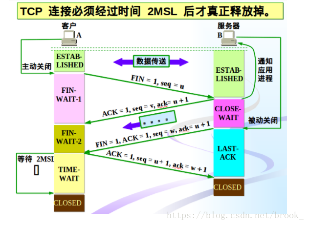
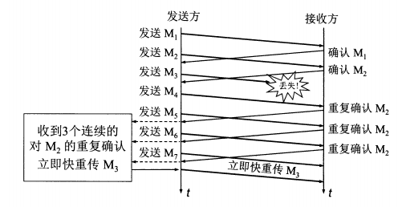
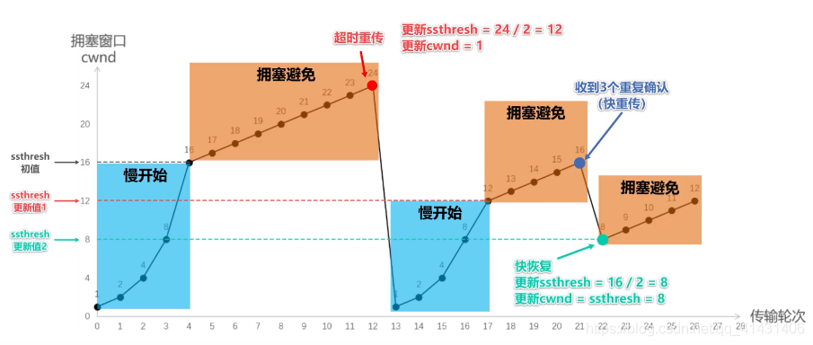

网络

poll、epoll、select模型
1、select 是用数组来存储socket的文件符，容量是固定的，轮训去确定是否发生IO
2、poll 和上面的区别仅仅是链表存储，可扩容
3、epoll是事件通知类型，发生了IO才会生成事件通知，不再主动轮训。

HTTPS是如何保证安全传输的？

1、建立TCP链接之后，服务端会向客户端传输非对称加密的公钥，客户端利用公钥加密数据传给服务端，服务端用私钥解密数据。
2、非对称加解密会很慢，所以一般是用非对称加密传输对称加密的密钥。然后就可以用对称加密传输数据。
3、但是黑客可能会获取到公钥，然后伪造自己的公钥发给客户端，然后客户端傻傻地将对称私钥发送给黑客，然后就给黑客传输数据了。
4、这时引入证书。服务端要建立HTTPS必须有一个证书，把证书(包含公钥)发送给客户端，如果客户端验证没问题，就利用这个公钥加密对称私钥，发送给服务端。然后两者开始用这一对称私钥愉快地加密传输了。其实这一破解思路就是让黑客没办法伪造公钥，或者说没办法伪造公认是安全的公钥。这样客户端就不会认可黑客的公钥而把私钥发送出去了。

TCP状态：
CLOSED：初始状态
LISTEN：服务端某个socket打开，被动监听着
SYN_RCVD：
SYN_SENT：
ESTABLISHED：
FIN_WAIT_1：
FIN_WAIT_2：
TIME_WAIT：
CLOSING：
CLOSE_WAIT：
LAST_ACK：
一、三次握手

1、A 发送SYN=1 Seq=X 包给B
2、B发送ACK=1 ack=X+1 SYN=1 Seq=Y包给A
3、A发送数据和ACK=1 ack=Y+1 Seq=Z包

二、四次挥手


1、A 发送FIN=1  Seq=X包
2、B发送ACK=1 ack=1+X Seq=Z，同时通知应用关闭连接
3、B发送FIN=1 Seq=Y包
4、A发送ACK=1 ack=1+Y包 等在2ML之后CLOSED

ps:超时重传是指没有收到ACK之后重新发送SYN或FIN包。

Q1:为什么握手是三次，挥手是四次
A1:因为握手时，SYN和ACK可以在同一个报文，而挥手时可能还需要一段时间来接受数据，接受完才发送FIN，所以FIN和ACK不能同时传送，也就是多了一次挥手。

Q2:为什么要握手三次？
A2:防止失效链接被服务端接受产生错误。为了防止服务器资源浪费。如果是两次握手，即收到SYN就进入ESTABLISHED状态。
那么出现一种情况，A发送SYN给B，此时网路堵塞，A超时重发第二个SYN。B收到了第二个SYN，AB成功建立连接。传输完数据，双方关闭连接。
之后网落堵塞的第一个SYN姗姗来迟到达了B，A此时又已处于关闭状态，此时B又进入ESTABLISHED，等待A传输数据，于是B成功浪费资源。

Q3:	为什么四次挥手中主动关闭方最后一次发送ACK之后，需要等待2ML之后才进入ClOSED？
A3:因为ACK可能会堵塞没能到达B端，如果直接进入CLOSED，那么B会一直处于LAST-ACK状态。需要一段时间用于重传后备。

以上所有问题都可以归咎于网络不稳定。

TCP syn攻击
原理是伪造大量客户端发送SYN包，等服务器进入SYN_RCVD后，又不回复ACK给服务器，导致服务器进入半链接状态。从而浪费服务器资源。
防范：
1、超时设置
在服务器进入半链接后，设定一个ACK接受超时时间，超过则中断半链接状态。不能设置太小，影响正常链接。不能太大，使得SYN攻击范围变大。只能减弱，不能根治。
2、SYN网关
客户端和网关沟通，网关和服务器沟通。如果网关收到服务器的SYN/ACK后，则转发给客户端，并立即给服务器回复ACK，使得服务器进入链接状态。原理是服务器更能承受链接状态，而非半链接状态
3、SYN代理
代理网关收到SYN包之后，以服务器的名义向客户端发送SYN/ACK，如果有回复ACK，才让服务器和客户端建立链接。

拥塞控制
滑动窗口(cwnd)：每次可发送的数据大小 比如4时，表示一次最大发送4个数据包。
门限(ssthresh)：拥塞避免的滑动窗口限制，比如滑动窗口超过这个值，则必须使用拥塞避免算法

慢开始：首次发送一个，后续轮次每次倍增，到达门限之后开始拥塞避免
拥塞避免：每次存次只能增1个窗口


超时重传是执行慢开始+拥塞避免
重复确认重传才执行快重传+快恢复
后面为了解决个别包丢失而导致直接满开始的消耗，新增了快重传、快恢复
快速重传：
如果发送方收到连续的三个重复确认，就立马发送该数据包，而不必等超时时间再重传。



快恢复：
门限直接减为当前滑动窗口的一半，然后执行拥塞避免




AIO、BIO、NIO
BIO：阻塞同步一个链接一个线程
NIO：非阻塞同步，多个链接共用一个线程，事件驱动的方式。请求方需要轮训结果
AIO：非阻塞异步，以上基础上，改成被动通知，操作系统会通知应用程序取结果

