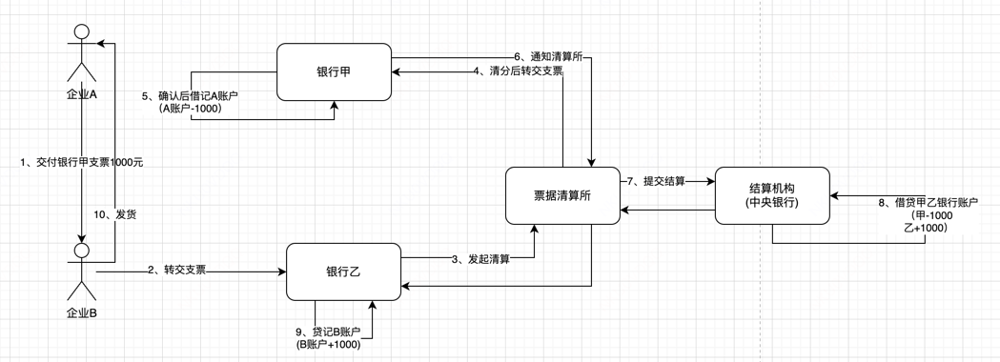
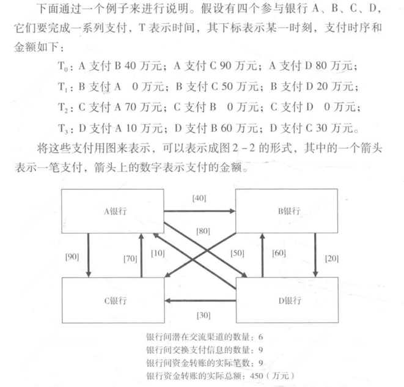
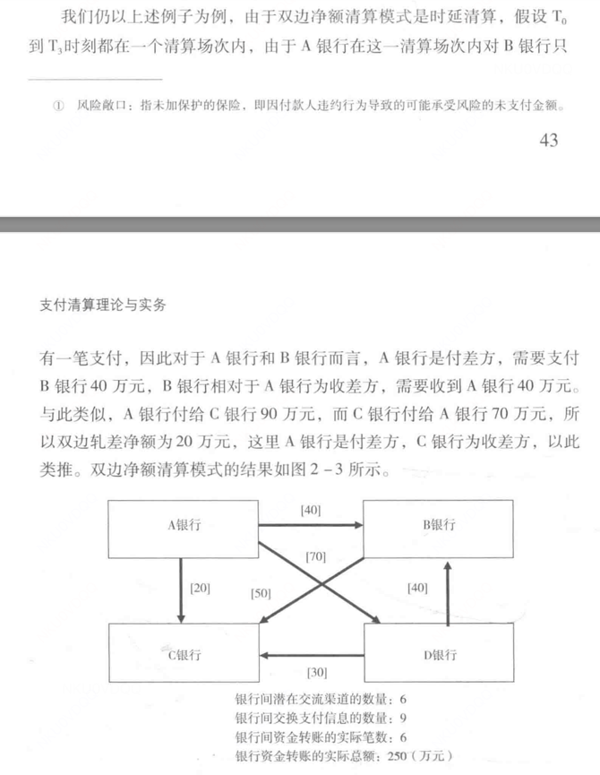
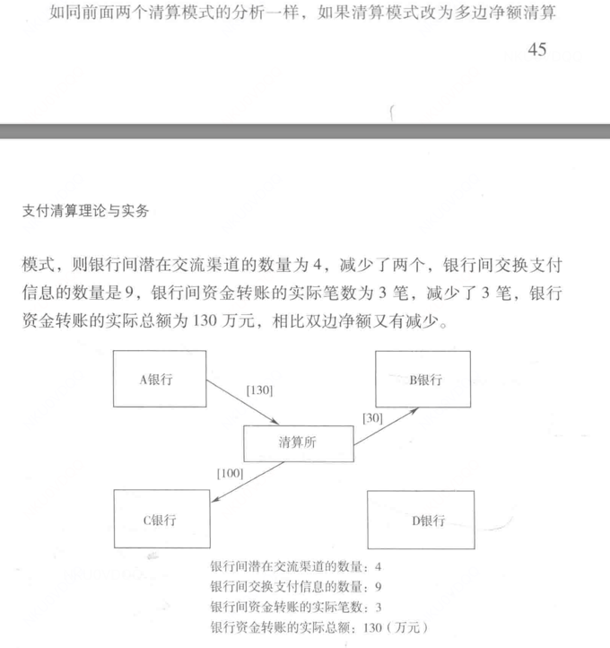
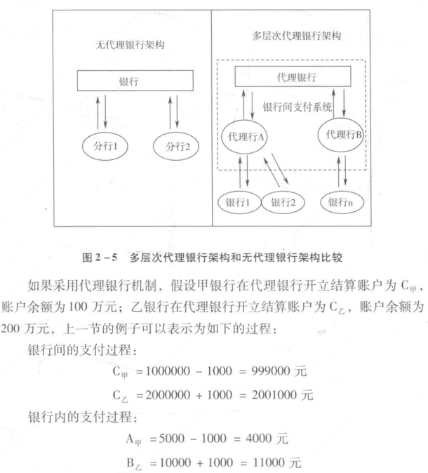
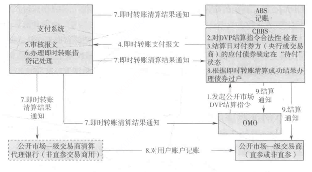
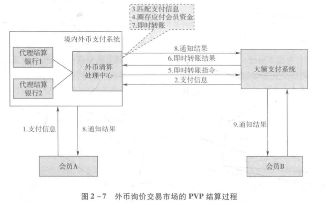

# 支付概论
## 支付的定义
支付是指付款人向收款人转移可以接受的货币债权的行为。
支付是一个系统，不仅涉及到买卖双方，还涉及到多个组织(银行、清算机构、央行)、多个系统、多个法律与制度安排。

现代 经济社会中，支付是一个复杂而精密的系统，包括支付工具，支付系统、支付组织和支付监管，多个系统协同合作，共同完成交易资金的转移。

## 清算和结算
清算(clearing)：是指结算前对支付工具清分、撮合，对待结算的债权债务进行计算、轧差的过程。
结算(seltlement):主要是指各个结算银行间资金的最终转移的过程，包括收集待结算的债权并进行完整性检验、 保证结算资金具有可用性，
结清金融机构之间的债权债务以及记录和通知各方。

# 支付清算理论
## 货币与支付
### 物物交换
假如经济中有N个交易人，每个人拥有一个需要交易的商品，如果采
取物物交换，那么要实现充分的交换，则每一对交易人之间都需要有一个交易的渠道。如果用图形来表示的话，交易人用图的顶点表示，物物交换的渠道用图的边表示
，则充分的无摩擦的物物交换可以表示为一个完全图，即每一个项点都与其他的顶点相连接。根据图论的知识，
完全图的边的数量为:Nx(N-1)/2。假定每一个渠道的成本(匹配、维护等)为常数C，则物物交换的总体成本TCI可以表示为:
TCI=C×Nx(N-1)/2

### 货币交易
假设有N个商品，N个互不认识的交易者，由于每对商品的交换采用货币交换，因此每对商品的交换是两次。
假设每一次交换的成本同样是C(也可以不是C，比如C2，此处简化为C)，那么，通过货币媒介的整体的交易成本TC2可以表示为:
TC2=2×N×C
现代商品交换是通过货币媒介，分成两次完成的，即先获得货币，然后付出货币得到所需要的商品。
在这一过程中，获得货币和付出货币，即货币资金转移的过程，就是所谓的支付过程。

## 货币形式
### 实物货币
实物货币是人类最早的货币形态，早期是盐、贝壳等商品，但这些货币不易保存、不易分割、不易携带等。
于是世界历史几乎都同样一种货币形态，即金属货币。金属货币具有价值稳定、易于分割、易于保存、便于携带等特点。同时也有些缺点，比如交易过程会磨损、产量有限、不利于大宗交易。
在进入资本主义后，金属货币的产出跟不上经济增长的速度。

### 信用货币
信用货币经历了几个阶段
(1) 不足值的金属货币
由于贵重金属的有限性，无法满足铸币的需求，所以金属货币往往掺杂其他便宜金属。当铸币机构发现不足值的货币也不影响货币职能的执行时，那么铸造不足值的金属货币就是必然的结果了。
(2) 可兑换纸币
可兑换纸市是指国家或银行以一定量的金属货币储备，发行本身没有价值的纸币，并宣布在任何时候任何地点，无条件地保证按纸币上记载的货币数额兑换相应的金属货币。
(3) 不可兑换纸币
不兑换纸币是指由政府发行的不能兑换成金币的纸币，这种不兑换纸币**已完全失去了内在的使用价值和价值**，而仅仅是一个观念上的符号，
但仍**保留着它所具有的数量特性**，其购买力源于国家的权威和信誉，只要这种权威和信誉不遭到质疑，国家就可以根据自己的意志来决定货币的发行量。
(4) 账户货币
账户货币也称为存款货币，是随着专营货币的银行机构的出现而广泛使用的。

### 货币的演进
#### 信用货币取代实物货币的必然性
实物货币的两个矛盾：供给受自然所限，缺乏弹性；实物货币的商品属性会干扰实物货币的货币属性；

#### 信用货币取代实物货币是量变到质变的过程
信用货币取代实物货币是个信用量不断提升的过程。
不足值金属货币信用来自金属本身和发行者；
可兑换纸币在不足值金属货币基础上加了国家信用；
不可兑换纸币的购买力则完全由国家信用担保；
#### 银行账户货币成为主要信用货币形式

## 银行支付

### 银行与支付变革
银行的出现是支付专业化需求的提现。中央银行、商业银行以及他们的支付服务构成一个国家主要的支付服务体系。

### 银行账户
账户是根据会计科目设置，具有一定的格式和结构，用于反应会计要素的增减变动情况以及结果的载体。

中央银行账户包括清算账户和非清算账户。
清算账户：主要指中央银行为银行业金融机构开立的办理现金存取、支付清算、再贷款、再贴现、公开市场等业务的准备金存款账户和备付金账户。
    准备金账户：各个银行按照存款准备金率和存款额应缴的款项
    备付金账户：用于存放各个银行用于支付结算的资金。
商业银行账户：商业银行为存款人开立的用于人民币、外币资金结算、储蓄和其他管理目的的存款账户，包括结算账户和其他账户。
    银行结算账户：按存款人分为单位银行结算账户和个人银行结算账户。
        单位结算账户：
            基本存款账户：用于转账结算和现金收付的账户。工资等**现金支付**只能通过该账户办理。一个企业只有一个基本存款账户。
            一般存款账户：该账户可以办理转账结算和存 人现金，但不能办理现金支付
            临时存款账户：该账户是企业因临时经营活动需要开立的账户。企业 可以通过该账户办理转账结算和现金收付。
            专用存款账户：专用用途的账户。

## 清算
支付分为三个过程：交易过程、清算过程、结算过程。
清算过程：包含了在收付款人金融机构之间交换支付工具以及计算金融机构之间待结算的债权，支付工具的交换也
包括交易撮合、交易清分、数据收集等。
结算过程： 该过程是完成债权最终转移的过程，包括收集待结算的债权并进行完整性检验、保证结算资
金具有可用性、结清金融机构之间的债权债务以及记录和通知各方。
清算和结算的主要区别就是清算机构一般不持有清算对象的账户，只用于清分债权，不进行账户结算操作。而结算都是持有账户，并对账户进行债务转移。

### 实时清算
实时清算对每一笔支付都进行实时结算，该模式对资金的流动性要求很高，信用风险最低(毕竟每一笔都实时结算了)。由于央行理论上具有无限的流动性，
而且央行更往往更关注市场的信用风险，避免爆发金融危机，因此央行往往青睐实时清算模式。

### 双边净额
延时清算是指在一定时间间隔后，将这段时间内所有的支付进行轧差计算后，得到每个参与者的应收应付净额，参与者在结算时只需要支付清算后的净额即可，不需要
对每一笔原始支付进行支付。
双边净额之后，正的净额方为收款方，负的净额方为付款方。如果是基于债权的，则成为双边净额。
双边净额节约了结算资金，但因有试验，信用风险更大。双边净额模式在金融支付领域应用更广泛，特别是零售支付领域(微信支付宝)。

### 多边净额
多边净额清算与双边净额清算的最大区别是，多边净额清算只有一个多边轧差的净额，**失去了直接的债务和债权方**，因此需要一个**共同的交易对手**来
承担结算的债权债务方，这一角色通常由清算机构来承担。

资金效率进一步提升，但有相应的制度成本(清算所)，单个银行失败对全体支付影响更大。

## 结算
国际结算银行将结算定义为完成债权债务的最终转移过程，包括收集待结算的债权并进行完整性检验、保证结算资金具有可用性、结清金融机构之间的债权债务以及记录和通知各方
结算一般分为实时结算和延时结算。
实时结算一般用于大额支付之间，安全行高，实时性好。
延时结算一般用于零售支付，资金效率高。

银行间的结算通常通过借贷账户操作即可。银行间的结算主要通过往来账户和代理银行方式进行。另外，为了提高结算的安全性，减少结算风险敞口，国际上目前倡导的模式
有DVP、PVP、中央对手方结算模式。
### 往来账户
每个银行都在其他往来银行开设账户，假设银行A与n家银行往来，则与n家银行互开往来账户。
缺点：当N逐渐增大，则往来账户数量呈现平方指数增长。

### 代理银行
假设一家银行可以集中持有其他银行的账户，并负责通过这些来账户来解决银行间的债券债务结算，那资金分散问题就能解决了。这类银行就是清算银行或结算银行。

相比往来账户，代理银行有如下优势。
1、成本优势。中小银行参与全国性支付系统，往往需要额外建设与之匹配的基础设施和员工费用。而代理银行通常是全国性，中小银行接入代理银行不需要全国性建设
成本。代理银行接入的客户行越多，成本又能更进一步降低，反过来吸引更多客户行。

### DVP
DVP：券款对付，用于债券交易。当且仅当一种资产的最终转账发生时，另一种资产的最终转账才发生。DVP结算的要义是资产交换的同步性和同时性，以闭合风险敞口。
锁定债券、过户资金、交割债券。三个操作要么一起成功，要么一起失败，可以看作计算机领域的事务。

#### PVP
PVP (Payment Versus Payment)结算----同时支付，是指外汇交易达成后，在双方指定的结算日，外汇的交割和资金的结算同步进行，并互为条件的一种结算方式。
外汇版本的DVP。本质都是希望能实现交易的两种资产最终转账的完整一致性。

## 支付的分类

### 分类的方法
分类的方式有很多，比如按
金额：大额支付和小额支付
工具介质：现金和非现金，进一步银行卡、支票支付、转账支付。
支付方向：借记支付和贷记支付
地域：现场支付、远程支付、国内支付、境外支付
币种：人民币支付、外币支付
渠道：互联网支付、移动支付
身份鉴别：密码支付、指纹支付、二维码支付
目前，国际上，一般按照支付**使用的介质**、支付的**借贷记方向**、支付**清算模式**以及支付**用途**来划分支付与清算种类。
在目前央行的统计又径中，一般以流通中的**现金货币**、各种**支付工具**、银行和新兴支付市场口径统计。
在理论研究中，通常使用**支付方向**、**清算模式**、**支付规模**、**支付技术**的分类方式。

### 借记支付和贷记支付
支付的发起方是付款方，则为贷记支付。比如支付宝支付等等
支付的发起方是收款方，则为借记支付。比如支票支付，收票银行要向签票银行收取款项。

### 实时支付和延迟支付

### 批发支付和零售支付
根据规模和对象的不同，分为批发支付和零售支付。
通常为金融机构提供的支付结算服务成为批发支付。
将为企业和个人提供支付结算服务称为零售支付。

# 支付体系
支付体系是为发起、转移对中央银行和商业银行的货币债权而形成的设施、机构和制度的有机结合。

